# Content-Aware Backup Platform (CABP) Client Application - Design Document

## Table of Contents

1. [Executive Summary](#executive-summary)
2. [System Overview](#system-overview)
3. [Architecture Design](#architecture-design)
4. [Component Design](#component-design)
5. [Workflow Scenarios](#workflow-scenarios)
6. [Technology Stack](#technology-stack)
7. [Future Enhancements](#future-enhancements)

---

## Executive Summary

The Content-Aware Backup Platform (CABP) Client Application is a standalone Python-based solution designed to provide an intuitive interface for interacting with the CABP backend services through REST APIs. This client application eliminates the need for users to directly interact with Swagger/OpenAPI interfaces, offering a streamlined, user-friendly experience for backup management operations.

### Key Objectives

| Objective                    | Description                                                                 |
|------------------------------|-----------------------------------------------------------------------------|
| **Simplification**           | Abstract complex API interactions into simple, scenario-driven workflows    |
| **Independence**             | Maintain complete decoupling from backend implementation                    |
| **Modularity**               | Implement clean architecture with reusable service modules                  |
| **Extensibility**            | Design for future enhancements including GUI and web-based dashboards       |

---

## System Overview

### Purpose

The CABP Client Application serves as a bridge between end-users and the CABP backend, providing:

- **Authentication Management**: Secure API key-based authentication
- **Data Ingestion**: Metadata and document upload capabilities
- **Search Operations**: Semantic and keyword-based search functionality
- **Management Operations**: File and document lifecycle management
- **Monitoring**: System health and topology visualization

### High-Level Architecture

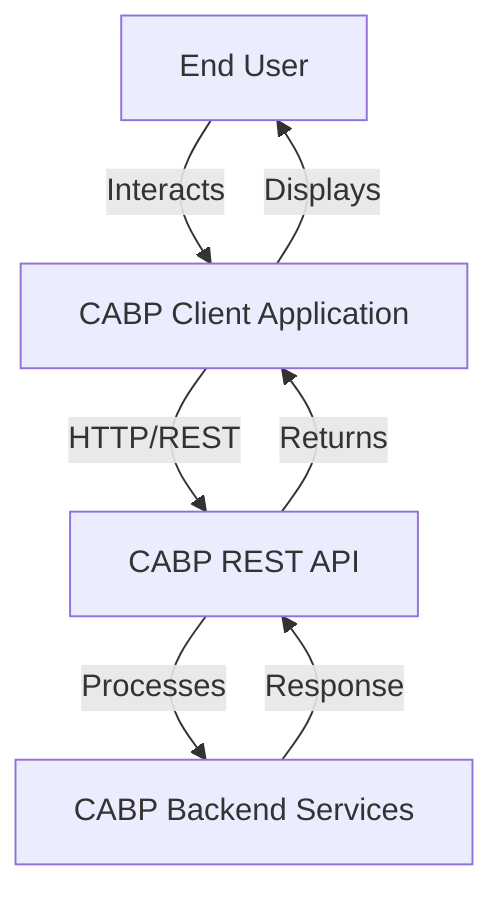

---

## Architecture Design

### Layered Architecture

The application follows a clean, layered architecture pattern to ensure separation of concerns and maintainability.

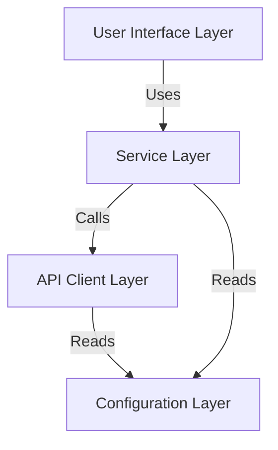

### Component Layers

| Layer                        | Responsibility                                              | Components                                    |
|------------------------------|-------------------------------------------------------------|-----------------------------------------------|
| **User Interface Layer**     | Handle user interactions and display results                | CLI Interface, Menu System                    |
| **Service Layer**            | Implement business logic and workflow orchestration         | Auth Service, Ingestion Service, Search Service, Management Service |
| **API Client Layer**         | Manage HTTP communication and API interactions              | HTTP Client, Request Handler, Response Parser |
| **Configuration Layer**      | Manage application settings and credentials                 | Config Manager, Environment Handler           |

### Module Structure

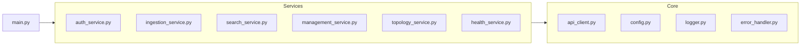

---

## Component Design

### 1. API Client Layer

The API Client Layer provides a reusable foundation for all HTTP communications.

#### Responsibilities

- HTTP request/response handling
- Authentication token management
- Error handling and retry logic
- Request/response logging
- Connection pooling

#### Class Diagram

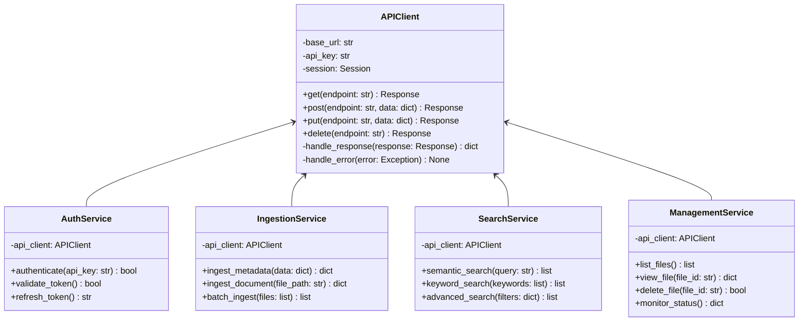

### 2. Service Layer Components

#### Authentication Service

| Method                | Parameters              | Returns        | Description                           |
|-----------------------|-------------------------|----------------|---------------------------------------|
| `authenticate()`      | `api_key: str`          | `bool`         | Authenticate user with API key        |
| `validate_token()`    | None                    | `bool`         | Validate current authentication token |
| `refresh_token()`     | None                    | `str`          | Refresh authentication token          |

#### Ingestion Service

| Method                | Parameters              | Returns        | Description                           |
|-----------------------|-------------------------|----------------|---------------------------------------|
| `ingest_metadata()`   | `data: dict`            | `dict`         | Ingest metadata into CABP             |
| `ingest_document()`   | `file_path: str`        | `dict`         | Upload and ingest document            |
| `batch_ingest()`      | `files: list`           | `list`         | Batch upload multiple files           |

#### Search Service

| Method                | Parameters              | Returns        | Description                           |
|-----------------------|-------------------------|----------------|---------------------------------------|
| `semantic_search()`   | `query: str`            | `list`         | Perform semantic search               |
| `keyword_search()`    | `keywords: list`        | `list`         | Perform keyword-based search          |
| `advanced_search()`   | `filters: dict`         | `list`         | Execute advanced filtered search      |

#### Management Service

| Method                | Parameters              | Returns        | Description                           |
|-----------------------|-------------------------|----------------|---------------------------------------|
| `list_files()`        | None                    | `list`         | List all files in system              |
| `view_file()`         | `file_id: str`          | `dict`         | View file details                     |
| `delete_file()`       | `file_id: str`          | `bool`         | Delete file from system               |
| `monitor_status()`    | None                    | `dict`         | Get system monitoring status          |

### 3. Configuration Management

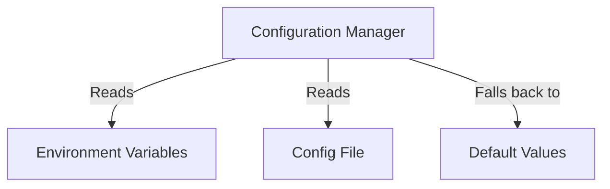

#### Configuration Parameters

| Parameter             | Type      | Default Value              | Description                           |
|-----------------------|-----------|----------------------------|---------------------------------------|
| `BASE_URL`            | `string`  | `http://localhost:8000`    | CABP API base URL                     |
| `API_KEY`             | `string`  | None                       | Authentication API key                |
| `TIMEOUT`             | `integer` | `30`                       | Request timeout in seconds            |
| `MAX_RETRIES`         | `integer` | `3`                        | Maximum retry attempts                |
| `LOG_LEVEL`           | `string`  | `INFO`                     | Logging level                         |
| `LOG_FILE`            | `string`  | `cabp_client.log`          | Log file path                         |

---

## Workflow Scenarios

### Primary Workflow: Authentication, Ingestion, Search, and Management

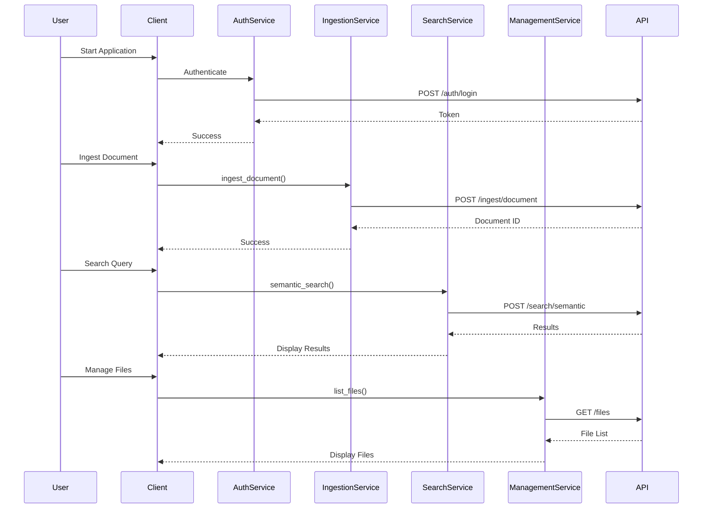

### Workflow States

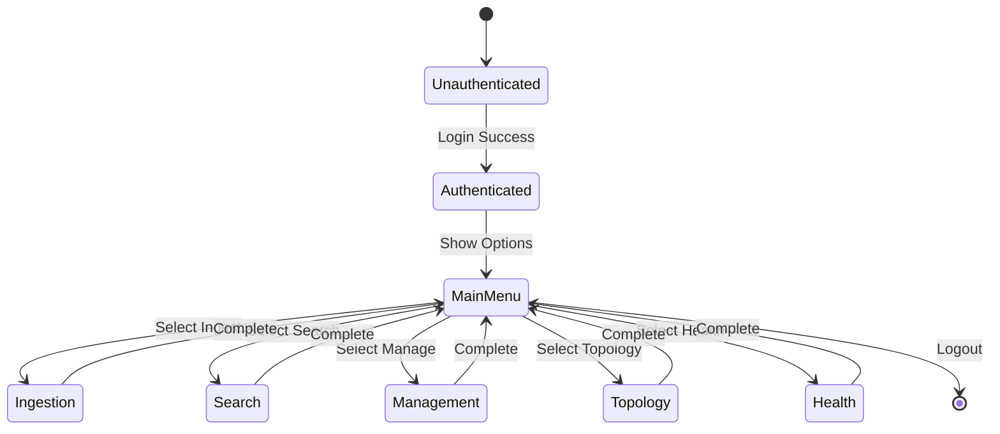

### Topology Explorer Workflow

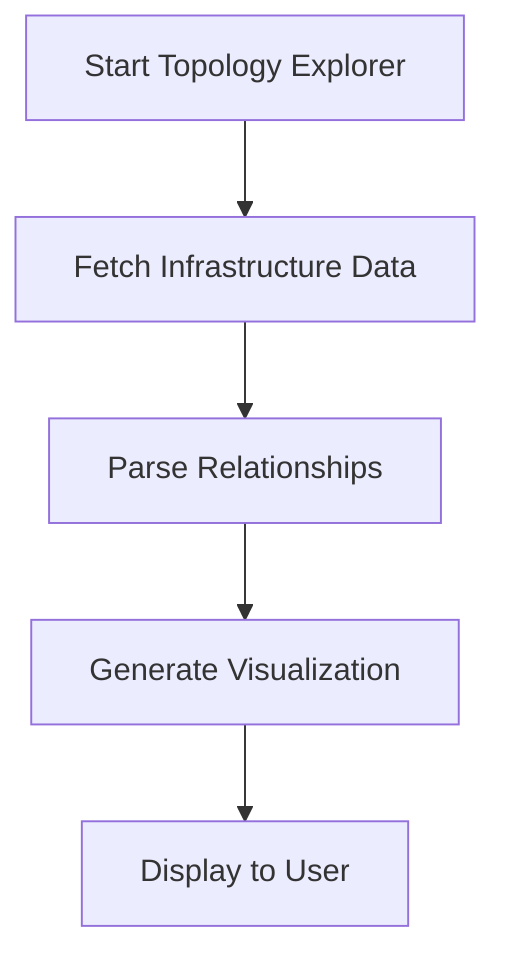

### Components and Health Dashboard Workflow

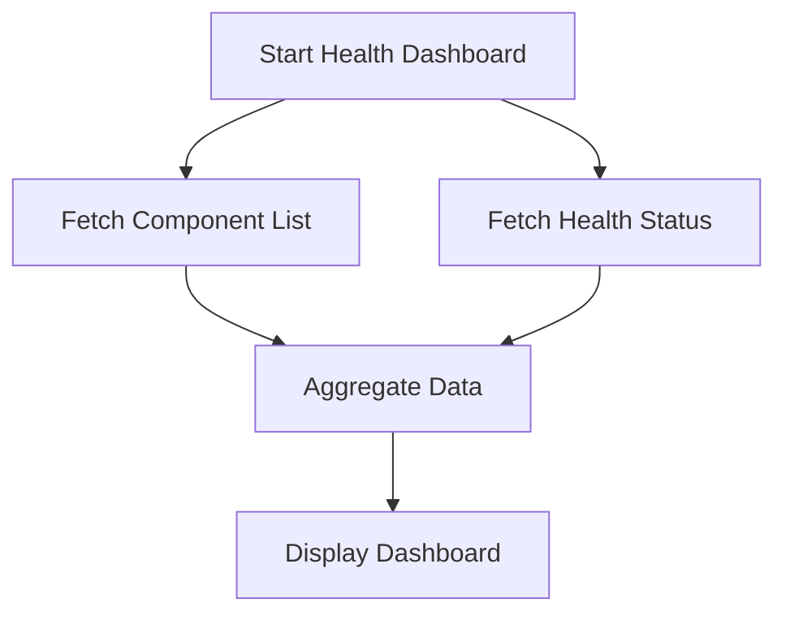

### Mapping Explorer Workflow

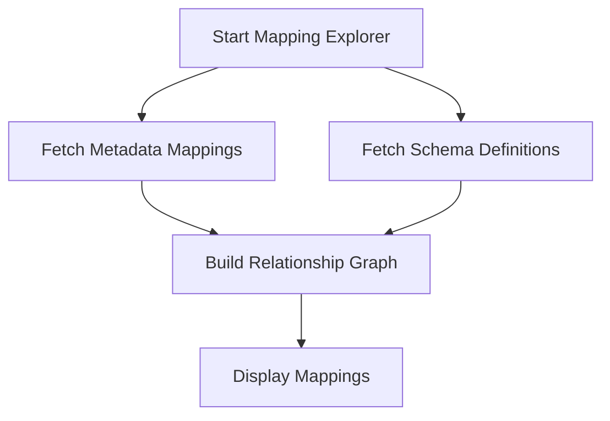

---

## Technology Stack

### Core Technologies

| Technology            | Version   | Purpose                                      |
|-----------------------|-----------|----------------------------------------------|
| **Python**            | 3.12+     | Primary programming language                 |
| **requests**          | Latest    | HTTP client library                          |
| **pydantic**          | Latest    | Data validation and settings management      |
| **python-dotenv**     | Latest    | Environment variable management              |
| **rich**              | Latest    | Terminal formatting and display              |

### Development Tools

| Tool                  | Purpose                                      |
|-----------------------|----------------------------------------------|
| **pytest**            | Unit and integration testing                 |
| **black**             | Code formatting                              |
| **pylint**            | Code linting and quality checks              |
| **mypy**              | Static type checking                         |

### Project Structure

```
client_server/
├── src/
│   ├── __init__.py
│   ├── main.py
│   ├── config.py
│   ├── api_client.py
│   ├── logger.py
│   ├── error_handler.py
│   └── services/
│       ├── __init__.py
│       ├── auth_service.py
│       ├── ingestion_service.py
│       ├── search_service.py
│       ├── management_service.py
│       ├── topology_service.py
│       ├── health_service.py
│       └── mapping_service.py
├── tests/
│   ├── __init__.py
│   ├── test_api_client.py
│   ├── test_auth_service.py
│   └── test_services.py
├── docs/
│   ├── design.md
│   └── api_reference.md
├── spec/
│   └── des.md
├── .env.example
├── requirements.txt
└── README.md
```

---

## Future Enhancements

### Planned Features

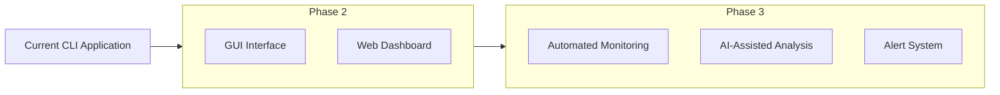

### Enhancement Roadmap

| Phase     | Feature                          | Description                                                    | Priority  |
|-----------|----------------------------------|----------------------------------------------------------------|-----------|
| **Phase 1** | CLI Application                | Current implementation with all core features                  | Complete  |
| **Phase 2** | GUI Support                    | Desktop application with graphical interface                   | High      |
| **Phase 2** | Web-based Dashboard            | Browser-based interface for remote access                      | High      |
| **Phase 3** | Automated Monitoring           | Scheduled health checks and status reports                     | Medium    |
| **Phase 3** | AI-Assisted Backup Analysis    | Machine learning for backup optimization recommendations       | Medium    |
| **Phase 3** | Alert System                   | Real-time notifications for system events                      | Low       |
| **Phase 4** | Multi-tenant Support           | Support for multiple CABP instances                            | Low       |
| **Phase 4** | Advanced Reporting             | Comprehensive analytics and reporting capabilities             | Low       |

### Technology Considerations for Future Phases

| Enhancement           | Recommended Technologies                                      |
|-----------------------|---------------------------------------------------------------|
| **GUI Interface**     | PyQt6, Tkinter, or Electron                                   |
| **Web Dashboard**     | FastAPI, React, or Vue.js                                     |
| **Monitoring**        | APScheduler, Celery                                           |
| **AI Analysis**       | scikit-learn, TensorFlow, or PyTorch                          |
| **Alerts**            | SMTP, Slack API, or webhook integrations                      |

---

## Conclusion

The Content-Aware Backup Platform (CABP) Client Application provides a robust, modular, and user-friendly interface for interacting with CABP backend services. By following clean architecture principles and maintaining complete independence from the backend implementation, the application ensures maintainability, scalability, and extensibility for future enhancements.

The scenario-driven approach simplifies complex API interactions, making backup management accessible to users without requiring technical expertise in REST APIs or Swagger interfaces. The modular design allows for easy addition of new features and workflows as requirements evolve.

---

**Document Version**: 1.0  
**Last Updated**: 2026-06-04  
**Status**: Draft