# Content-Aware Backup Platform (CABP) Client Application - Implementation Guide

## Table of Contents

1. [Implementation Overview](#implementation-overview)
2. [API Analysis and Endpoint Categorization](#api-analysis-and-endpoint-categorization)
3. [Project Structure Setup](#project-structure-setup)
4. [API Client Layer Development](#api-client-layer-development)
5. [Service Module Implementation](#service-module-implementation)
6. [Scenario-Based Workflow Implementation](#scenario-based-workflow-implementation)
7. [Command-Line Interface Development](#command-line-interface-development)
8. [Testing and Validation](#testing-and-validation)
9. [Deployment and Delivery](#deployment-and-delivery)

---

## Implementation Overview

### Purpose

This document outlines the systematic implementation approach for the CABP Client Application, detailing the step-by-step process from API analysis through final delivery. The implementation follows a modular, scenario-driven methodology that ensures clean architecture, maintainability, and complete independence from the backend codebase.

### Implementation Philosophy

| Principle                    | Description                                                                 |
|------------------------------|-----------------------------------------------------------------------------|
| **API-First Analysis**       | Begin with comprehensive Swagger/OpenAPI specification analysis             |
| **Modular Architecture**     | Organize code into dedicated service modules by functional domain           |
| **Scenario-Driven**          | Implement user workflows rather than exposing raw API endpoints             |
| **Clean Architecture**       | Maintain clear separation between layers and components                     |
| **Reusability**              | Build reusable components for common functionality                          |

### Implementation Flow

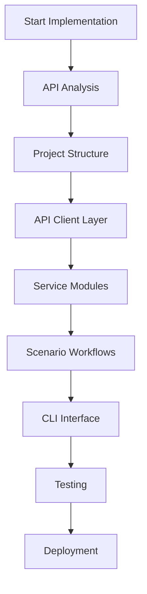

---

## API Analysis and Endpoint Categorization

### Step 1: Swagger/OpenAPI Specification Analysis

**Objective**: Identify and categorize all available endpoints from the CABP backend API specification.

#### Analysis Process

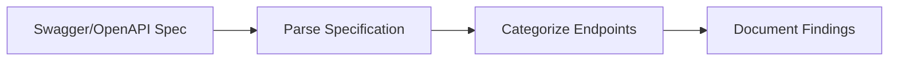

#### Endpoint Categorization

| Module                | Endpoints                                    | Purpose                                      |
|-----------------------|----------------------------------------------|----------------------------------------------|
| **Authentication**    | `/auth/login`, `/auth/validate`, `/auth/refresh` | User authentication and session management   |
| **Ingestion**         | `/ingest/metadata`, `/ingest/document`, `/ingest/status` | Data and document ingestion operations       |
| **Search**            | `/search/semantic`, `/search/keyword`, `/search/advanced` | Search functionality across different modes  |
| **Management**        | `/files`, `/files/{id}`, `/documents`, `/documents/{id}` | File and document management operations      |
| **Topology**          | `/topology`, `/topology/relationships` | Infrastructure topology exploration          |
| **Components**        | `/components`, `/components/{id}` | Component information and status             |
| **Health**            | `/health`, `/health/status`, `/health/components` | System health monitoring                     |
| **Mappings**          | `/mappings`, `/mappings/schema` | Metadata mapping visualization               |

#### Analysis Deliverables

- [ ] Complete endpoint inventory
- [ ] Endpoint categorization by functional domain
- [ ] Request/response schema documentation
- [ ] Authentication requirements per endpoint
- [ ] Error response patterns

### Step 2: API Contract Documentation

**Create detailed documentation for each endpoint category:**

```markdown
## Authentication Module

### POST /auth/login
- **Purpose**: Authenticate user with API key
- **Request**: `{ "api_key": "string" }`
- **Response**: `{ "token": "string", "expires_at": "datetime" }`
- **Errors**: 401 (Invalid credentials), 500 (Server error)

### GET /auth/validate
- **Purpose**: Validate current authentication token
- **Headers**: `Authorization: Bearer {token}`
- **Response**: `{ "valid": boolean, "expires_at": "datetime" }`
- **Errors**: 401 (Invalid token)
```

---

## Project Structure Setup

### Step 3: Establish Modular Project Structure

**Objective**: Create a well-organized project structure that supports clean architecture and modularity.

#### Directory Structure

```
cabp-client/
├── src/
│   ├── __init__.py
│   ├── main.py                      # Application entry point
│   ├── config.py                    # Configuration management
│   ├── api_client.py                # Reusable API client layer
│   ├── logger.py                    # Logging configuration
│   ├── error_handler.py             # Error handling utilities
│   ├── models.py                    # Data models and schemas
│   └── services/
│       ├── __init__.py
│       ├── auth_service.py          # Authentication service
│       ├── ingestion_service.py     # Ingestion service
│       ├── search_service.py        # Search service
│       ├── management_service.py    # Management service
│       ├── topology_service.py      # Topology service
│       ├── components_service.py    # Components service
│       ├── health_service.py        # Health service
│       └── mappings_service.py      # Mappings service
├── tests/
│   ├── __init__.py
│   ├── test_api_client.py
│   ├── test_config.py
│   └── test_services/
│       ├── __init__.py
│       ├── test_auth_service.py
│       ├── test_ingestion_service.py
│       ├── test_search_service.py
│       └── test_management_service.py
├── docs/
│   ├── design.md
│   ├── requirements.md
│   ├── implementation.md
│   └── api_reference.md
├── spec/
│   ├── des.md
│   ├── req.md
│   └── imp.md
├── .env.example
├── .gitignore
├── requirements.txt
├── setup.py
└── README.md
```

#### Project Structure Diagram

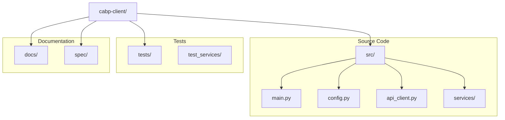

#### Setup Commands

```bash
# Create project directory
mkdir -p cabp-client/{src/services,tests/test_services,docs,spec}

# Create __init__.py files
touch cabp-client/src/__init__.py
touch cabp-client/src/services/__init__.py
touch cabp-client/tests/__init__.py
touch cabp-client/tests/test_services/__init__.py

# Create core files
touch cabp-client/src/{main.py,config.py,api_client.py,logger.py,error_handler.py,models.py}

# Create service files
touch cabp-client/src/services/{auth_service.py,ingestion_service.py,search_service.py,management_service.py,topology_service.py,components_service.py,health_service.py,mappings_service.py}

# Create configuration files
touch cabp-client/{.env.example,.gitignore,requirements.txt,setup.py,README.md}
```

---

## API Client Layer Development

### Step 4: Develop Reusable API Client

**Objective**: Create a centralized API client that handles all HTTP communication with the CABP backend.

#### API Client Responsibilities

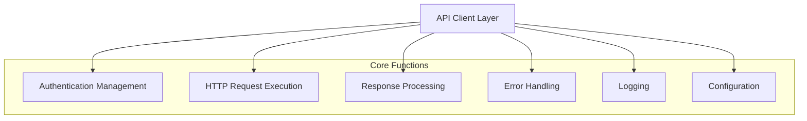

#### Implementation Components

| Component                    | Purpose                                      | Key Features                                 |
|------------------------------|----------------------------------------------|----------------------------------------------|
| **Configuration Manager**    | Manage application settings                  | Environment variables, validation, defaults  |
| **Logger**                   | Structured logging                           | File/console output, log levels, rotation    |
| **Error Handler**            | Exception management                         | Custom exceptions, error mapping, logging    |
| **HTTP Client**              | API communication                            | Request/response, retry logic, timeouts      |

#### Configuration Management (config.py)

**Key Features**:
- Environment variable loading
- Type validation using Pydantic
- Default value handling
- Configuration validation

**Implementation Priority**: Critical

#### Logging System (logger.py)

**Key Features**:
- Multiple log levels (DEBUG, INFO, WARNING, ERROR, CRITICAL)
- Dual output (console and file)
- Structured log format with timestamps
- Automatic log file management

**Implementation Priority**: Critical

#### Error Handling (error_handler.py)

**Key Features**:
- Custom exception hierarchy
- HTTP status code mapping
- Detailed error context
- User-friendly error messages

**Exception Hierarchy**:

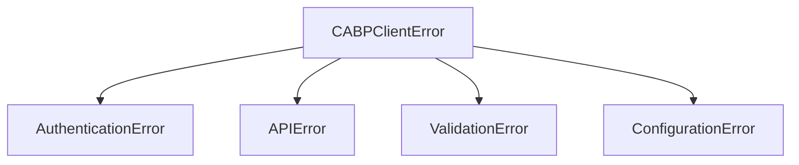

#### HTTP Client (api_client.py)

**Key Features**:
- RESTful API communication
- Authentication token management
- Automatic retry logic
- Request/response logging
- Connection pooling
- Timeout handling

**Request Flow**:

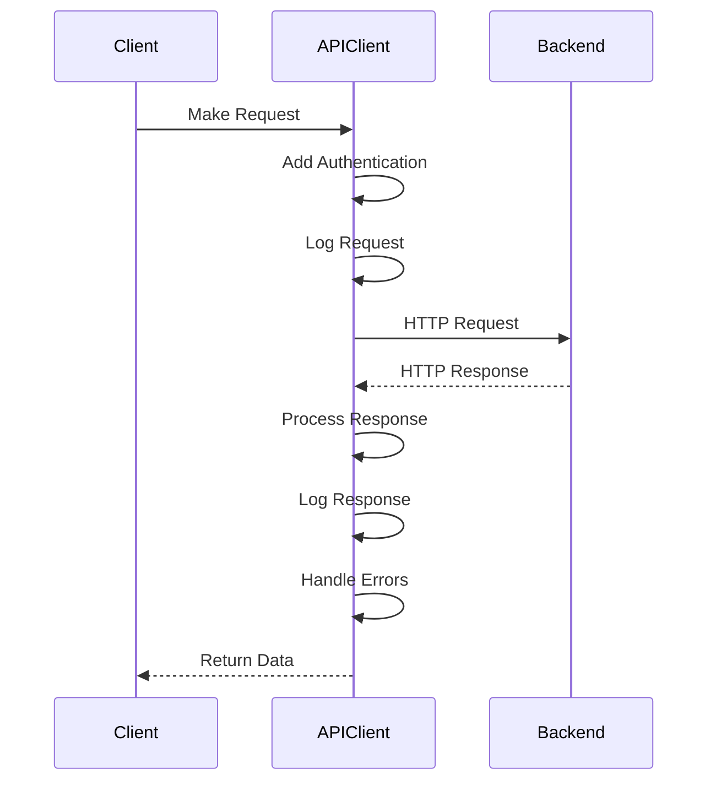

---

## Service Module Implementation

### Step 5: Implement Dedicated Service Classes

**Objective**: Create service modules for each functional domain, mapping API endpoints to service methods.

#### Service Architecture

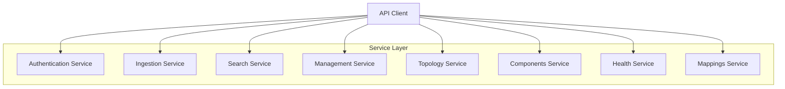

#### Service Implementation Pattern

Each service follows a consistent pattern:

1. **Initialization**: Accept API client instance
2. **Method Mapping**: Map API endpoints to service methods
3. **Data Validation**: Validate input parameters
4. **API Communication**: Use API client for requests
5. **Response Processing**: Transform API responses
6. **Error Handling**: Handle and propagate errors

#### Authentication Service (auth_service.py)

**Endpoints Mapped**:
- `POST /auth/login` → `authenticate(api_key)`
- `GET /auth/validate` → `validate_token()`
- `POST /auth/refresh` → `refresh_token()`

**Implementation Focus**:
- Secure credential handling
- Token storage and management
- Session state maintenance

#### Ingestion Service (ingestion_service.py)

**Endpoints Mapped**:
- `POST /ingest/metadata` → `ingest_metadata(metadata)`
- `POST /ingest/document` → `ingest_document(file_path)`
- `POST /ingest/batch` → `batch_ingest(file_paths)`
- `GET /ingest/status/{id}` → `get_ingestion_status(ingestion_id)`

**Implementation Focus**:
- File validation
- Upload progress tracking
- Batch processing logic
- Status monitoring

#### Search Service (search_service.py)

**Endpoints Mapped**:
- `POST /search/semantic` → `semantic_search(query, limit, filters)`
- `POST /search/keyword` → `keyword_search(keywords, limit, operator)`
- `POST /search/advanced` → `advanced_search(filters, limit)`

**Implementation Focus**:
- Query construction
- Result pagination
- Filter application
- Result formatting

#### Management Service (management_service.py)

**Endpoints Mapped**:
- `GET /files` → `list_files(limit, offset, filters)`
- `GET /files/{id}` → `view_file(file_id)`
- `DELETE /files/{id}` → `delete_file(file_id)`
- `GET /documents` → `list_documents(limit, offset)`
- `GET /documents/{id}` → `view_document(document_id)`
- `DELETE /documents/{id}` → `delete_document(document_id)`
- `GET /status` → `monitor_status()`

**Implementation Focus**:
- List pagination
- Detail retrieval
- Deletion confirmation
- Status aggregation

#### Topology Service (topology_service.py)

**Endpoints Mapped**:
- `GET /topology` → `get_topology()`
- `GET /topology/relationships` → `get_relationships(node_id)`

**Implementation Focus**:
- Topology data retrieval
- Relationship mapping
- Visualization preparation

#### Components Service (components_service.py)

**Endpoints Mapped**:
- `GET /components` → `list_components()`
- `GET /components/{id}` → `get_component_details(component_id)`

**Implementation Focus**:
- Component enumeration
- Status retrieval
- Detail formatting

#### Health Service (health_service.py)

**Endpoints Mapped**:
- `GET /health` → `get_overall_health()`
- `GET /health/status` → `get_health_status()`
- `GET /health/components` → `get_component_health()`

**Implementation Focus**:
- Health data aggregation
- Status interpretation
- Alert identification

#### Mappings Service (mappings_service.py)

**Endpoints Mapped**:
- `GET /mappings` → `get_all_mappings()`
- `GET /mappings/schema` → `get_schema_mappings(schema_id)`

**Implementation Focus**:
- Mapping retrieval
- Schema relationship extraction
- Visualization data preparation

---

## Scenario-Based Workflow Implementation

### Step 6: Implement User Workflows

**Objective**: Create scenario-driven workflows that integrate multiple services to accomplish user tasks.

#### Primary Workflow: Authentication, Ingestion, Search, and Management

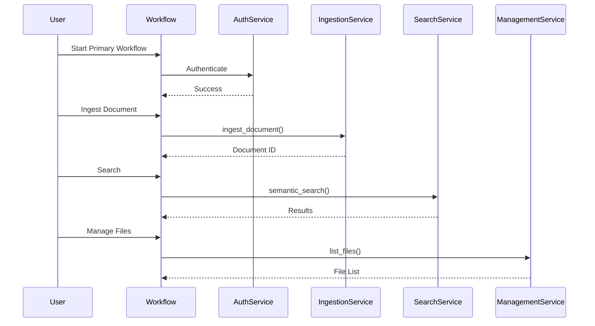

#### Workflow Implementation Structure

| Workflow                     | Services Used                                | Purpose                                      |
|------------------------------|----------------------------------------------|----------------------------------------------|
| **Primary Workflow**         | Auth, Ingestion, Search, Management          | Core operations: authenticate, ingest, search, manage |
| **Topology Exploration**     | Auth, Topology                               | Visualize infrastructure relationships       |
| **Health Monitoring**        | Auth, Health, Components                     | Monitor system health and component status   |
| **Mapping Visualization**    | Auth, Mappings                               | View metadata mappings and schemas           |

#### Workflow State Management

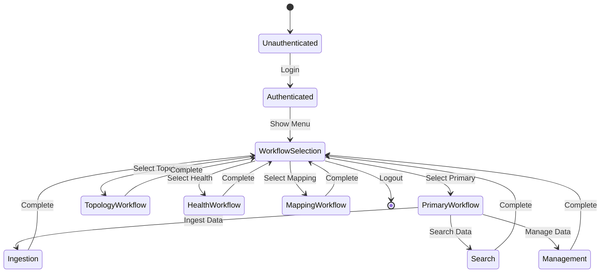

#### Implementation Approach

1. **Workflow Orchestration**: Create workflow coordinator class
2. **Service Integration**: Connect multiple services within workflows
3. **State Management**: Maintain workflow state and context
4. **Error Recovery**: Handle errors gracefully within workflows
5. **User Guidance**: Provide clear prompts and feedback

---

## Command-Line Interface Development

### Step 7: Develop Interactive CLI

**Objective**: Create a menu-driven command-line interface that guides users through workflows.

#### CLI Architecture

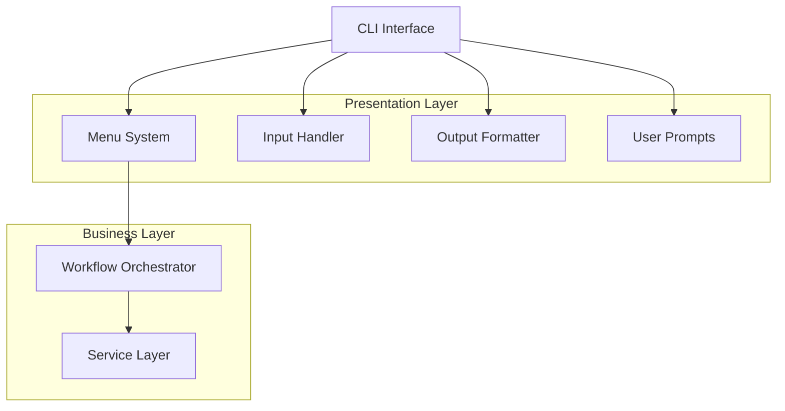

#### CLI Components

| Component                    | Purpose                                      | Implementation                               |
|------------------------------|----------------------------------------------|----------------------------------------------|
| **Menu System**              | Display navigation options                   | Hierarchical menu structure                  |
| **Input Handler**            | Process user input                           | Validation, type conversion, error handling  |
| **Output Formatter**         | Display information clearly                  | Tables, panels, color coding                 |
| **Prompt System**            | Guide user interactions                      | Context-aware prompts, suggestions           |

#### Menu Structure

```
Main Menu
├── 1. Ingest Data
│   ├── 1.1 Ingest Metadata
│   ├── 1.2 Ingest Document
│   ├── 1.3 Batch Ingest
│   └── 1.4 Check Ingestion Status
├── 2. Search
│   ├── 2.1 Semantic Search
│   ├── 2.2 Keyword Search
│   └── 2.3 Advanced Search
├── 3. Manage Files/Documents
│   ├── 3.1 List Files
│   ├── 3.2 View File Details
│   ├── 3.3 Delete File
│   ├── 3.4 List Documents
│   ├── 3.5 View Document Details
│   └── 3.6 Delete Document
├── 4. System Status
├── 5. Topology Explorer
├── 6. Health Dashboard
├── 7. Mapping Explorer
└── 0. Exit
```

#### Output Formatting

**Information Display Formats**:

| Data Type                    | Format                                       | Library                                      |
|------------------------------|----------------------------------------------|----------------------------------------------|
| **Lists**                    | Tables with columns                          | rich.table.Table                             |
| **Details**                  | Panels with structured content               | rich.panel.Panel                             |
| **Status**                   | Progress bars and spinners                   | rich.progress                                |
| **Errors**                   | Colored error messages                       | rich.console (red)                           |
| **Success**                  | Colored success messages                     | rich.console (green)                         |

#### User Interaction Flow

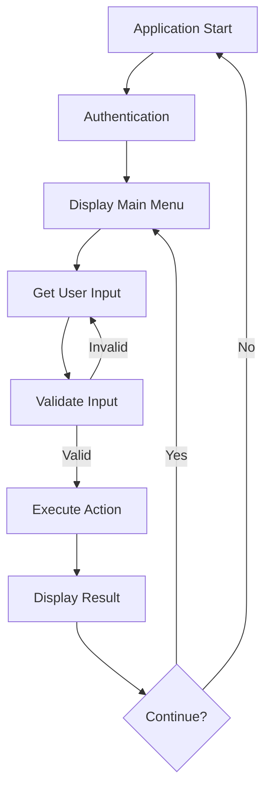

---

## Testing and Validation

### Step 8: Test Against CABP Backend

**Objective**: Validate API integration, workflow execution, error handling, and system reliability.

#### Testing Strategy

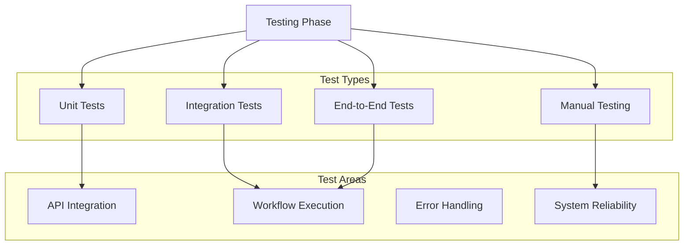

#### Test Coverage Requirements

| Component                    | Coverage Target | Test Types                                   |
|------------------------------|-----------------|----------------------------------------------|
| **Configuration**            | 100%            | Unit tests                                   |
| **API Client**               | 95%+            | Unit, Integration tests                      |
| **Services**                 | 90%+            | Unit, Integration tests                      |
| **Workflows**                | 85%+            | Integration, E2E tests                       |
| **CLI**                      | 80%+            | Integration, Manual tests                    |

#### Testing Checklist

**API Integration Testing**:
- [ ] All endpoints are accessible
- [ ] Authentication works correctly
- [ ] Request/response formats are correct
- [ ] Error responses are handled properly
- [ ] Timeout and retry logic functions

**Workflow Execution Testing**:
- [ ] Primary workflow completes successfully
- [ ] Topology exploration works
- [ ] Health monitoring displays correctly
- [ ] Mapping visualization functions
- [ ] State transitions are correct

**Error Handling Testing**:
- [ ] Invalid credentials are rejected
- [ ] Network errors are handled gracefully
- [ ] API errors display meaningful messages
- [ ] Validation errors are caught
- [ ] Recovery from errors is possible

**System Reliability Testing**:
- [ ] Application remains stable under load
- [ ] Memory usage is acceptable
- [ ] Long-running operations complete
- [ ] Concurrent operations work correctly
- [ ] Application recovers from crashes

---

## Deployment and Delivery

### Step 9: Final Implementation Delivery

**Objective**: Deliver a fully functional, standalone Python client application.

#### Deployment Checklist

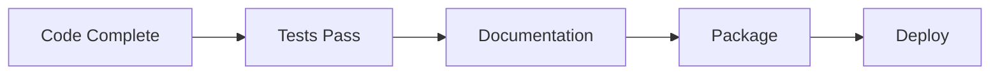

#### Pre-Deployment Validation

| Task                         | Status      | Validation Criteria                          |
|------------------------------|-------------|----------------------------------------------|
| **Code Quality**             | ☐ Complete  | All linting checks pass                      |
| **Test Coverage**            | ☐ Complete  | Coverage targets met                         |
| **Documentation**            | ☐ Complete  | All docs updated and accurate                |
| **Configuration**            | ☐ Complete  | Environment variables documented             |
| **Dependencies**             | ☐ Complete  | requirements.txt is current                  |
| **Error Handling**           | ☐ Complete  | All error paths tested                       |
| **Logging**                  | ☐ Complete  | Comprehensive logging in place               |
| **Security**                 | ☐ Complete  | No hardcoded credentials                     |

#### Deployment Package Contents

```
cabp-client-v1.0.0/
├── src/                          # Source code
├── tests/                        # Test suite
├── docs/                         # Documentation
│   ├── design.md
│   ├── requirements.md
│   ├── implementation.md
│   └── user_guide.md
├── .env.example                  # Configuration template
├── requirements.txt              # Dependencies
├── setup.py                      # Installation script
├── README.md                     # Quick start guide
└── LICENSE                       # License information
```

#### Installation Instructions

```bash
# Clone or extract the package
cd cabp-client-v1.0.0

# Create virtual environment
python3.12 -m venv venv
source venv/bin/activate  # On Windows: venv\Scripts\activate

# Install dependencies
pip install -r requirements.txt

# Configure application
cp .env.example .env
# Edit .env with your settings

# Run application
python -m src.main
```

#### Delivery Verification

**Functional Verification**:
- [ ] Application starts without errors
- [ ] Authentication works with valid credentials
- [ ] All workflows are accessible
- [ ] Data ingestion completes successfully
- [ ] Search returns results
- [ ] Management operations work
- [ ] Topology/Health/Mapping features function

**Non-Functional Verification**:
- [ ] Performance meets requirements
- [ ] Error messages are clear
- [ ] Logging is comprehensive
- [ ] Configuration is flexible
- [ ] Documentation is complete

---

## Implementation Timeline

### Phased Implementation Approach

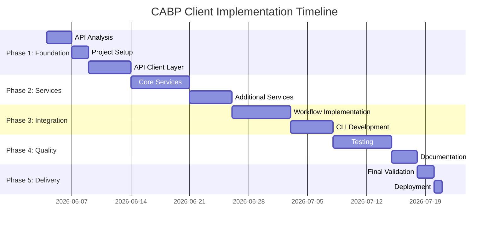

### Implementation Milestones

| Milestone                    | Target Date  | Deliverables                                 |
|------------------------------|--------------|----------------------------------------------|
| **API Analysis Complete**    | Day 3        | Endpoint documentation, categorization       |
| **Foundation Ready**         | Day 9        | Project structure, API client, core utilities|
| **Services Implemented**     | Day 21       | All service modules functional               |
| **Workflows Complete**       | Day 33       | All user workflows implemented               |
| **Testing Complete**         | Day 40       | All tests passing, coverage targets met      |
| **Documentation Complete**   | Day 43       | All documentation finalized                  |
| **Deployment Ready**         | Day 45       | Final package ready for delivery             |

---

## Best Practices and Guidelines

### Code Quality Standards

| Standard                     | Requirement                                  | Tool                                         |
|------------------------------|----------------------------------------------|----------------------------------------------|
| **Code Formatting**          | PEP 8 compliance                             | black, autopep8                              |
| **Linting**                  | Score > 8/10                                 | pylint, flake8                               |
| **Type Hints**               | All functions typed                          | mypy                                         |
| **Documentation**            | Docstrings for all public APIs               | pydocstyle                                   |
| **Test Coverage**            | > 80% overall                                | pytest-cov                                   |

### Architecture Principles

1. **Separation of Concerns**: Each module has a single, well-defined responsibility
2. **Dependency Injection**: Services receive dependencies rather than creating them
3. **Interface Segregation**: Services expose only necessary methods
4. **DRY Principle**: Reuse common functionality through shared utilities
5. **Error Handling**: Comprehensive exception handling at all layers

### Logging Guidelines

```python
# Log levels usage
logger.debug("Detailed diagnostic information")
logger.info("General informational messages")
logger.warning("Warning messages for potential issues")
logger.error("Error messages for failures")
logger.critical("Critical errors requiring immediate attention")
```

### Configuration Management

- Use environment variables for deployment-specific settings
- Provide sensible defaults for all configuration values
- Validate configuration on application startup
- Document all configuration options

---

## Conclusion

This implementation guide provides a comprehensive, step-by-step approach to building the CABP Client Application. By following this systematic methodology—from API analysis through final delivery—the development team will create a robust, maintainable, and user-friendly client that successfully abstracts the complexity of the CABP backend while maintaining complete independence from its implementation.

### Key Success Factors

- **Thorough API Analysis**: Understanding the backend API is foundational
- **Clean Architecture**: Modular design ensures maintainability
- **Scenario-Driven Approach**: User workflows over raw API exposure
- **Comprehensive Testing**: Quality assurance throughout development
- **Clear Documentation**: Supporting long-term maintenance and enhancement

### Final Deliverable

A fully functional, standalone Python client application that:
- ✅ Operates independently of backend codebase
- ✅ Provides simplified, user-friendly interface
- ✅ Implements scenario-based workflows
- ✅ Maintains clean, modular architecture
- ✅ Includes comprehensive testing and documentation
- ✅ Supports future enhancements and scalability

---

**Document Version**: 1.0  
**Last Updated**: 2026-06-04  
**Status**: Final