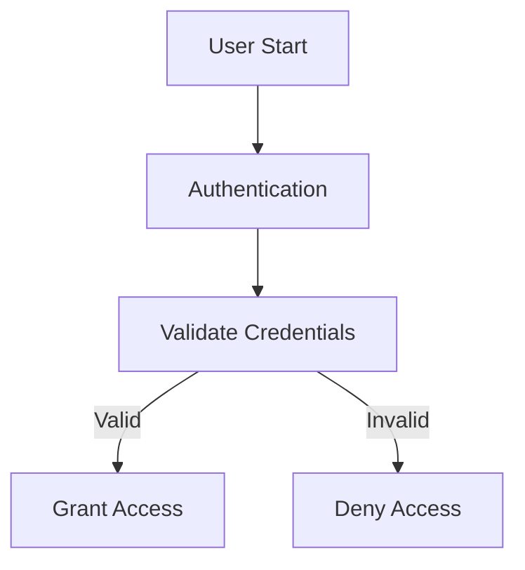
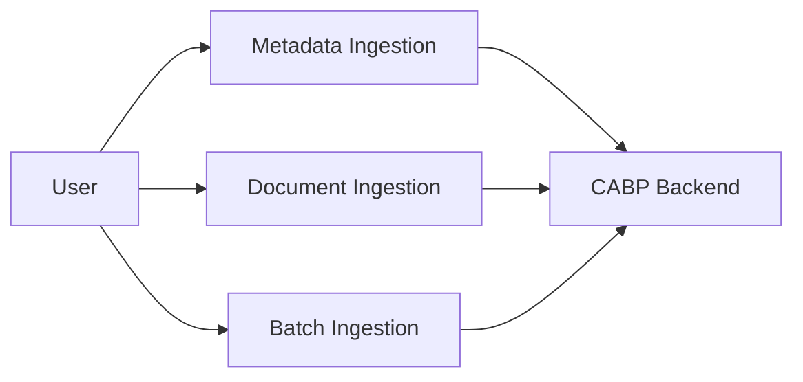
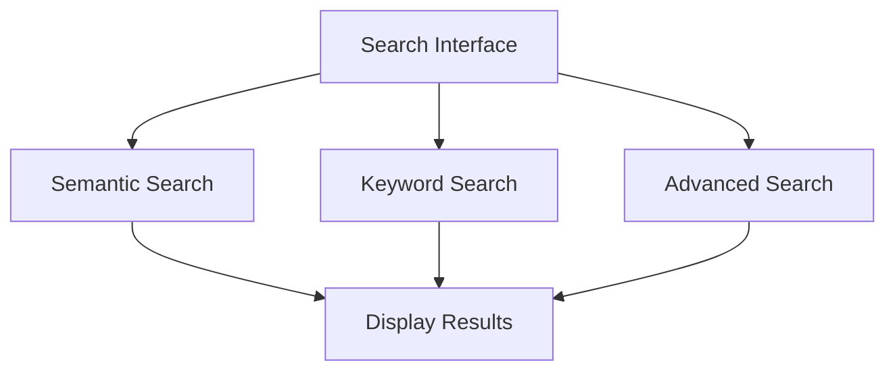
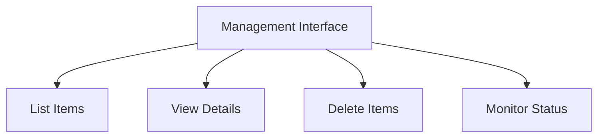
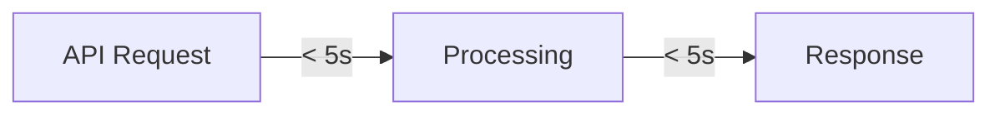
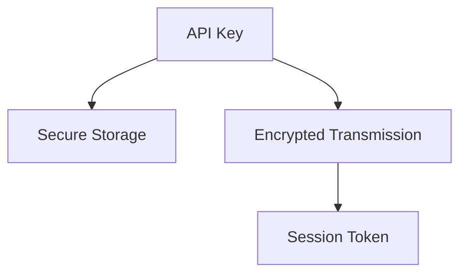

# Content-Aware Backup Platform (CABP) Client Application - Requirements Document

## Table of Contents

1. [Executive Summary](#executive-summary)
2. [Functional Requirements](#functional-requirements)
3. [Non-Functional Requirements](#non-functional-requirements)
4. [Technical Requirements](#technical-requirements)
5. [System Requirements](#system-requirements)
6. [Security Requirements](#security-requirements)
7. [Interface Requirements](#interface-requirements)
8. [Operational Requirements](#operational-requirements)
9. [Future Requirements](#future-requirements)

---

## Executive Summary

### Purpose

The Content-Aware Backup Platform (CABP) Client Application shall be developed as a standalone Python-based solution that communicates with the existing Content-Aware Backup Platform through REST APIs exposed via Swagger/OpenAPI. The client must operate independently of the backend codebase and provide a simplified, user-friendly interface for end users.

### Scope

This document defines the complete set of requirements for the CABP Client Application, including functional capabilities, technical specifications, security considerations, and operational needs.

### Key Objectives

| Objective                    | Description                                                                 |
|------------------------------|-----------------------------------------------------------------------------|
| **Independence**             | Complete separation from backend implementation                             |
| **Simplification**           | User-friendly interface abstracting API complexity                          |
| **Scenario-Based**           | Workflow-driven approach rather than direct API exposure                    |
| **Scalability**              | Architecture supporting future enhancements                                 |
| **Maintainability**          | Clean, modular design for long-term sustainability                          |

---

## Functional Requirements

### FR-1: Authentication and Authorization



#### FR-1.1: API Key Authentication

| Requirement ID | FR-1.1                                                                      |
|----------------|-----------------------------------------------------------------------------|
| **Priority**   | Critical                                                                    |
| **Description**| The application SHALL support API key-based authentication                  |
| **Details**    | - Accept API key from user input or environment variable<br>- Validate API key with backend<br>- Store authentication token securely<br>- Handle authentication failures gracefully |
| **Acceptance Criteria** | - User can authenticate using valid API key<br>- Invalid API key results in clear error message<br>- Authentication token is stored for session duration |

#### FR-1.2: Session Management

| Requirement ID | FR-1.2                                                                      |
|----------------|-----------------------------------------------------------------------------|
| **Priority**   | High                                                                        |
| **Description**| The application SHALL manage user sessions securely                         |
| **Details**    | - Maintain authentication state during session<br>- Validate token before API calls<br>- Refresh token when necessary<br>- Clear session on logout |
| **Acceptance Criteria** | - Session persists across operations<br>- Token refresh is automatic<br>- Logout clears all session data |

### FR-2: Data Ingestion



#### FR-2.1: Metadata Ingestion

| Requirement ID | FR-2.1                                                                      |
|----------------|-----------------------------------------------------------------------------|
| **Priority**   | High                                                                        |
| **Description**| The application SHALL support metadata ingestion                            |
| **Details**    | - Accept metadata in structured format<br>- Validate metadata before submission<br>- Submit metadata to backend via API<br>- Return ingestion confirmation with ID |
| **Acceptance Criteria** | - Valid metadata is successfully ingested<br>- Invalid metadata is rejected with error details<br>- Ingestion ID is returned for tracking |

#### FR-2.2: Document Ingestion

| Requirement ID | FR-2.2                                                                      |
|----------------|-----------------------------------------------------------------------------|
| **Priority**   | High                                                                        |
| **Description**| The application SHALL support document file ingestion                       |
| **Details**    | - Accept document file path from user<br>- Validate file exists and is readable<br>- Upload file to backend<br>- Track upload progress<br>- Return ingestion status |
| **Acceptance Criteria** | - Documents are successfully uploaded<br>- File validation prevents invalid uploads<br>- Upload progress is visible to user<br>- Ingestion status is tracked |

#### FR-2.3: Batch Ingestion

| Requirement ID | FR-2.3                                                                      |
|----------------|-----------------------------------------------------------------------------|
| **Priority**   | Medium                                                                      |
| **Description**| The application SHALL support batch ingestion of multiple files             |
| **Details**    | - Accept multiple file paths<br>- Process files sequentially or in parallel<br>- Report individual file status<br>- Provide overall batch summary |
| **Acceptance Criteria** | - Multiple files can be ingested in one operation<br>- Individual file status is reported<br>- Batch summary shows success/failure counts |

#### FR-2.4: Ingestion Status Monitoring

| Requirement ID | FR-2.4                                                                      |
|----------------|-----------------------------------------------------------------------------|
| **Priority**   | Medium                                                                      |
| **Description**| The application SHALL allow monitoring of ingestion operations              |
| **Details**    | - Query ingestion status by ID<br>- Display processing state<br>- Show completion percentage<br>- Report errors if any |
| **Acceptance Criteria** | - Users can check status of ongoing ingestions<br>- Status information is accurate and current<br>- Errors are clearly reported |

### FR-3: Search Capabilities



#### FR-3.1: Semantic Search

| Requirement ID | FR-3.1                                                                      |
|----------------|-----------------------------------------------------------------------------|
| **Priority**   | High                                                                        |
| **Description**| The application SHALL support semantic search functionality                 |
| **Details**    | - Accept natural language queries<br>- Submit query to semantic search API<br>- Retrieve and display results<br>- Support result pagination<br>- Allow result filtering |
| **Acceptance Criteria** | - Natural language queries return relevant results<br>- Results are ranked by relevance<br>- Pagination works correctly<br>- Filters can be applied |

#### FR-3.2: Keyword Search

| Requirement ID | FR-3.2                                                                      |
|----------------|-----------------------------------------------------------------------------|
| **Priority**   | High                                                                        |
| **Description**| The application SHALL support keyword-based search                          |
| **Details**    | - Accept keyword list from user<br>- Support boolean operators (AND/OR)<br>- Submit to keyword search API<br>- Display matching results |
| **Acceptance Criteria** | - Keyword searches return matching documents<br>- Boolean operators work correctly<br>- Results are accurate and complete |

#### FR-3.3: Advanced Search

| Requirement ID | FR-3.3                                                                      |
|----------------|-----------------------------------------------------------------------------|
| **Priority**   | Medium                                                                      |
| **Description**| The application SHALL support advanced filtered search                      |
| **Details**    | - Accept multiple filter criteria<br>- Support date ranges<br>- Support metadata filters<br>- Combine multiple filters<br>- Display filtered results |
| **Acceptance Criteria** | - Multiple filters can be combined<br>- Date range filtering works<br>- Metadata filters are applied correctly<br>- Results match all criteria |

### FR-4: Management Operations



#### FR-4.1: File Listing

| Requirement ID | FR-4.1                                                                      |
|----------------|-----------------------------------------------------------------------------|
| **Priority**   | High                                                                        |
| **Description**| The application SHALL list available files and documents                    |
| **Details**    | - Retrieve file list from backend<br>- Display in readable format<br>- Support pagination<br>- Show key metadata (name, size, date) |
| **Acceptance Criteria** | - All files are listed<br>- Pagination works for large lists<br>- Metadata is displayed correctly |

#### FR-4.2: File/Document Viewing

| Requirement ID | FR-4.2                                                                      |
|----------------|-----------------------------------------------------------------------------|
| **Priority**   | High                                                                        |
| **Description**| The application SHALL display detailed file/document information            |
| **Details**    | - Retrieve details by ID<br>- Display all metadata<br>- Show relationships<br>- Present in structured format |
| **Acceptance Criteria** | - Complete details are displayed<br>- Information is accurate<br>- Format is readable and organized |

#### FR-4.3: File/Document Deletion

| Requirement ID | FR-4.3                                                                      |
|----------------|-----------------------------------------------------------------------------|
| **Priority**   | Medium                                                                      |
| **Description**| The application SHALL support deletion of files and documents               |
| **Details**    | - Accept deletion request<br>- Confirm before deletion<br>- Execute deletion via API<br>- Report success/failure |
| **Acceptance Criteria** | - Deletion requires confirmation<br>- Successful deletions are confirmed<br>- Failures are reported with reasons |

#### FR-4.4: System Status Monitoring

| Requirement ID | FR-4.4                                                                      |
|----------------|-----------------------------------------------------------------------------|
| **Priority**   | Medium                                                                      |
| **Description**| The application SHALL display system monitoring information                 |
| **Details**    | - Query system status<br>- Display key metrics<br>- Show service health<br>- Present in dashboard format |
| **Acceptance Criteria** | - Status information is current<br>- Metrics are accurate<br>- Health indicators are clear |

### FR-5: Topology Explorer

#### FR-5.1: Infrastructure Visualization

| Requirement ID | FR-5.1                                                                      |
|----------------|-----------------------------------------------------------------------------|
| **Priority**   | Low                                                                         |
| **Description**| The application SHALL visualize infrastructure topology                     |
| **Details**    | - Retrieve topology data<br>- Display relationships<br>- Show node connections<br>- Support interactive exploration |
| **Acceptance Criteria** | - Topology is accurately represented<br>- Relationships are clear<br>- Navigation is intuitive |

### FR-6: Health Dashboard

#### FR-6.1: Component Health Monitoring

| Requirement ID | FR-6.1                                                                      |
|----------------|-----------------------------------------------------------------------------|
| **Priority**   | Low                                                                         |
| **Description**| The application SHALL display component health status                       |
| **Details**    | - Query component health<br>- Display status indicators<br>- Show availability metrics<br>- Alert on issues |
| **Acceptance Criteria** | - Health status is accurate<br>- Issues are highlighted<br>- Metrics are current |

### FR-7: Mapping Explorer

#### FR-7.1: Metadata Mapping Visualization

| Requirement ID | FR-7.1                                                                      |
|----------------|-----------------------------------------------------------------------------|
| **Priority**   | Low                                                                         |
| **Description**| The application SHALL visualize metadata mappings                           |
| **Details**    | - Retrieve mapping definitions<br>- Display schema relationships<br>- Show field mappings<br>- Support exploration |
| **Acceptance Criteria** | - Mappings are clearly displayed<br>- Relationships are visible<br>- Schema structure is understandable |

---

## Non-Functional Requirements

### NFR-1: Performance



#### NFR-1.1: Response Time

| Requirement ID | NFR-1.1                                                                     |
|----------------|-----------------------------------------------------------------------------|
| **Priority**   | High                                                                        |
| **Description**| The application SHALL respond to user actions within acceptable timeframes  |
| **Metrics**    | - API calls: < 5 seconds<br>- UI updates: < 1 second<br>- Search results: < 3 seconds |
| **Acceptance Criteria** | - 95% of operations meet timing requirements<br>- Slow operations show progress indicators |

#### NFR-1.2: Scalability

| Requirement ID | NFR-1.2                                                                     |
|----------------|-----------------------------------------------------------------------------|
| **Priority**   | Medium                                                                      |
| **Description**| The application SHALL handle increasing data volumes efficiently            |
| **Metrics**    | - Support 1000+ files<br>- Handle 100+ concurrent operations<br>- Process large files (>1GB) |
| **Acceptance Criteria** | - Performance degrades gracefully<br>- Large datasets are paginated<br>- Memory usage is controlled |

### NFR-2: Reliability

#### NFR-2.1: Error Handling

| Requirement ID | NFR-2.1                                                                     |
|----------------|-----------------------------------------------------------------------------|
| **Priority**   | Critical                                                                    |
| **Description**| The application SHALL handle errors gracefully                              |
| **Details**    | - Catch all exceptions<br>- Provide meaningful error messages<br>- Log errors for debugging<br>- Recover from transient failures |
| **Acceptance Criteria** | - No unhandled exceptions<br>- Error messages are user-friendly<br>- Application remains stable after errors |

#### NFR-2.2: Availability

| Requirement ID | NFR-2.2                                                                     |
|----------------|-----------------------------------------------------------------------------|
| **Priority**   | High                                                                        |
| **Description**| The application SHALL be available when backend is accessible               |
| **Metrics**    | - 99% uptime when backend is available<br>- Automatic reconnection on network issues |
| **Acceptance Criteria** | - Application recovers from temporary disconnections<br>- Users are notified of backend unavailability |

### NFR-3: Usability

#### NFR-3.1: User Interface

| Requirement ID | NFR-3.1                                                                     |
|----------------|-----------------------------------------------------------------------------|
| **Priority**   | High                                                                        |
| **Description**| The application SHALL provide an intuitive user interface                   |
| **Details**    | - Clear menu structure<br>- Consistent navigation<br>- Helpful prompts<br>- Readable output formatting |
| **Acceptance Criteria** | - New users can complete basic tasks without training<br>- Navigation is logical<br>- Output is well-formatted |

#### NFR-3.2: Documentation

| Requirement ID | NFR-3.2                                                                     |
|----------------|-----------------------------------------------------------------------------|
| **Priority**   | Medium                                                                      |
| **Description**| The application SHALL be well-documented                                    |
| **Details**    | - User guide<br>- API documentation<br>- Code comments<br>- Troubleshooting guide |
| **Acceptance Criteria** | - Documentation covers all features<br>- Examples are provided<br>- Common issues are documented |

### NFR-4: Maintainability

#### NFR-4.1: Code Quality

| Requirement ID | NFR-4.1                                                                     |
|----------------|-----------------------------------------------------------------------------|
| **Priority**   | High                                                                        |
| **Description**| The application SHALL maintain high code quality standards                  |
| **Metrics**    | - Code coverage > 80%<br>- Linting score > 8/10<br>- No critical security issues |
| **Acceptance Criteria** | - Code passes all quality checks<br>- Tests are comprehensive<br>- Security vulnerabilities are addressed |

---

## Technical Requirements

### TR-1: Technology Stack

```mermaid
graph TD
    Python[Python 3.12]
    
    subgraph Core Libraries
        Requests[requests]
        Pydantic[pydantic]
        DotEnv[python-dotenv]
        Rich[rich]
    end
    
    subgraph Dev Tools
        Pytest[pytest]
        Black[black]
        Pylint[pylint]
        Mypy[mypy]
    end
    
    Python --> Core Libraries
    Python --> Dev Tools
```

#### TR-1.1: Programming Language

| Requirement ID | TR-1.1                                                                      |
|----------------|-----------------------------------------------------------------------------|
| **Priority**   | Critical                                                                    |
| **Description**| The application SHALL be developed using Python 3.12                        |
| **Rationale**  | - Modern Python features<br>- Strong ecosystem<br>- Backend compatibility |
| **Acceptance Criteria** | - All code is Python 3.12 compatible<br>- No deprecated features used |

#### TR-1.2: Core Dependencies

| Requirement ID | TR-1.2                                                                      |
|----------------|-----------------------------------------------------------------------------|
| **Priority**   | Critical                                                                    |
| **Description**| The application SHALL use specified core libraries                          |
| **Libraries**  | - requests: HTTP client<br>- pydantic: Data validation<br>- python-dotenv: Configuration<br>- rich: Terminal UI |
| **Acceptance Criteria** | - All dependencies are properly declared<br>- Versions are pinned<br>- No conflicting dependencies |

### TR-2: Architecture

#### TR-2.1: Modular Design

| Requirement ID | TR-2.1                                                                      |
|----------------|-----------------------------------------------------------------------------|
| **Priority**   | High                                                                        |
| **Description**| The application SHALL follow a clean, modular architecture                  |
| **Components** | - Configuration layer<br>- API client layer<br>- Service layer<br>- Interface layer |
| **Acceptance Criteria** | - Clear separation of concerns<br>- Reusable components<br>- Minimal coupling |

#### TR-2.2: Service Organization

| Requirement ID | TR-2.2                                                                      |
|----------------|-----------------------------------------------------------------------------|
| **Priority**   | High                                                                        |
| **Description**| The application SHALL organize services by domain                           |
| **Services**   | - Authentication<br>- Ingestion<br>- Search<br>- Management<br>- Topology<br>- Health<br>- Mapping |
| **Acceptance Criteria** | - Each service has clear responsibility<br>- Services are independent<br>- Common functionality is shared |

### TR-3: Communication

#### TR-3.1: HTTP Communication

| Requirement ID | TR-3.1                                                                      |
|----------------|-----------------------------------------------------------------------------|
| **Priority**   | Critical                                                                    |
| **Description**| The application SHALL communicate via HTTP/HTTPS                            |
| **Details**    | - RESTful API calls<br>- JSON data format<br>- Proper HTTP methods<br>- Standard status codes |
| **Acceptance Criteria** | - All API calls use correct HTTP methods<br>- Requests/responses are JSON<br>- Status codes are handled properly |

#### TR-3.2: API Client

| Requirement ID | TR-3.2                                                                      |
|----------------|-----------------------------------------------------------------------------|
| **Priority**   | Critical                                                                    |
| **Description**| The application SHALL implement a reusable API client                       |
| **Features**   | - Request/response handling<br>- Authentication management<br>- Error handling<br>- Retry logic<br>- Logging |
| **Acceptance Criteria** | - Single API client used throughout<br>- All features implemented<br>- Client is well-tested |

---

## System Requirements

### SR-1: Platform Compatibility

| Requirement ID | SR-1                                                                        |
|----------------|-----------------------------------------------------------------------------|
| **Priority**   | High                                                                        |
| **Description**| The application SHALL run on multiple platforms                             |
| **Platforms**  | - Linux (Ubuntu 20.04+)<br>- macOS (11.0+)<br>- Windows (10+) |
| **Acceptance Criteria** | - Application runs on all specified platforms<br>- No platform-specific issues |

### SR-2: Dependencies

| Requirement ID | SR-2                                                                        |
|----------------|-----------------------------------------------------------------------------|
| **Priority**   | High                                                                        |
| **Description**| The application SHALL have minimal external dependencies                    |
| **Details**    | - Python 3.12+<br>- Standard library<br>- Declared pip packages<br>- No system-level dependencies |
| **Acceptance Criteria** | - Installation is straightforward<br>- Dependencies are documented<br>- No hidden requirements |

---

## Security Requirements

### SEC-1: Authentication Security



#### SEC-1.1: Credential Management

| Requirement ID | SEC-1.1                                                                     |
|----------------|-----------------------------------------------------------------------------|
| **Priority**   | Critical                                                                    |
| **Description**| The application SHALL handle credentials securely                           |
| **Details**    | - No hardcoded credentials<br>- Environment variable storage<br>- Secure input prompts<br>- No credential logging |
| **Acceptance Criteria** | - Credentials never appear in code<br>- Logs don't contain sensitive data<br>- Input is masked |

#### SEC-1.2: Communication Security

| Requirement ID | SEC-1.2                                                                     |
|----------------|-----------------------------------------------------------------------------|
| **Priority**   | Critical                                                                    |
| **Description**| The application SHALL use secure communication                              |
| **Details**    | - HTTPS for production<br>- TLS 1.2+<br>- Certificate validation<br>- Secure headers |
| **Acceptance Criteria** | - Production uses HTTPS<br>- Certificates are validated<br>- Security headers are set |

### SEC-2: Data Protection

#### SEC-2.1: Data Handling

| Requirement ID | SEC-2.1                                                                     |
|----------------|-----------------------------------------------------------------------------|
| **Priority**   | High                                                                        |
| **Description**| The application SHALL protect sensitive data                                |
| **Details**    | - No sensitive data in logs<br>- Secure temporary files<br>- Memory cleanup<br>- Secure deletion |
| **Acceptance Criteria** | - Sensitive data is protected<br>- Temporary files are secured<br>- Memory is cleared |

---

## Interface Requirements

### INT-1: Command-Line Interface

#### INT-1.1: Interactive CLI

| Requirement ID | INT-1.1                                                                     |
|----------------|-----------------------------------------------------------------------------|
| **Priority**   | Critical                                                                    |
| **Description**| The application SHALL provide an interactive command-line interface         |
| **Features**   | - Menu-driven navigation<br>- Clear prompts<br>- Input validation<br>- Formatted output |
| **Acceptance Criteria** | - CLI is intuitive<br>- All features accessible<br>- Output is readable |

#### INT-1.2: Output Formatting

| Requirement ID | INT-1.2                                                                     |
|----------------|-----------------------------------------------------------------------------|
| **Priority**   | High                                                                        |
| **Description**| The application SHALL present information in readable format                |
| **Details**    | - Tables for lists<br>- Structured details<br>- Color coding<br>- Progress indicators |
| **Acceptance Criteria** | - Output is well-formatted<br>- Information is organized<br>- Visual cues are helpful |

---

## Operational Requirements

### OP-1: Configuration Management

#### OP-1.1: Environment Configuration

| Requirement ID | OP-1.1                                                                      |
|----------------|-----------------------------------------------------------------------------|
| **Priority**   | High                                                                        |
| **Description**| The application SHALL support environment-based configuration               |
| **Details**    | - Environment variables<br>- Configuration files<br>- Default values<br>- Validation |
| **Acceptance Criteria** | - Configuration is flexible<br>- Defaults are sensible<br>- Validation prevents errors |

### OP-2: Logging

#### OP-2.1: Application Logging

| Requirement ID | OP-2.1                                                                      |
|----------------|-----------------------------------------------------------------------------|
| **Priority**   | High                                                                        |
| **Description**| The application SHALL implement comprehensive logging                       |
| **Details**    | - Multiple log levels<br>- File and console output<br>- Structured format<br>- Log rotation |
| **Acceptance Criteria** | - All operations are logged<br>- Logs are useful for debugging<br>- Log files are managed |

### OP-3: Error Reporting

#### OP-3.1: User-Friendly Errors

| Requirement ID | OP-3.1                                                                      |
|----------------|-----------------------------------------------------------------------------|
| **Priority**   | High                                                                        |
| **Description**| The application SHALL provide clear error messages                          |
| **Details**    | - Descriptive messages<br>- Actionable guidance<br>- Error codes<br>- Context information |
| **Acceptance Criteria** | - Errors are understandable<br>- Users know how to resolve issues<br>- Technical details are logged |

---

## Future Requirements

### FUT-1: Graphical User Interface

| Requirement ID | FUT-1                                                                       |
|----------------|-----------------------------------------------------------------------------|
| **Priority**   | Future                                                                      |
| **Description**| The application MAY support a graphical user interface                      |
| **Details**    | - Desktop application<br>- Modern UI framework<br>- All CLI features<br>- Enhanced visualization |
| **Timeline**   | Phase 2                                                                     |

### FUT-2: Web Dashboard

| Requirement ID | FUT-2                                                                       |
|----------------|-----------------------------------------------------------------------------|
| **Priority**   | Future                                                                      |
| **Description**| The application MAY provide a web-based dashboard                           |
| **Details**    | - Browser-based access<br>- Real-time updates<br>- Multi-user support<br>- Advanced analytics |
| **Timeline**   | Phase 2                                                                     |

### FUT-3: Automated Monitoring

| Requirement ID | FUT-3                                                                       |
|----------------|-----------------------------------------------------------------------------|
| **Priority**   | Future                                                                      |
| **Description**| The application MAY include automated monitoring features                   |
| **Details**    | - Scheduled health checks<br>- Automated reports<br>- Alert notifications<br>- Trend analysis |
| **Timeline**   | Phase 3                                                                     |

### FUT-4: AI-Assisted Analysis

| Requirement ID | FUT-4                                                                       |
|----------------|-----------------------------------------------------------------------------|
| **Priority**   | Future                                                                      |
| **Description**| The application MAY incorporate AI-assisted backup analysis                 |
| **Details**    | - Intelligent recommendations<br>- Pattern detection<br>- Optimization suggestions<br>- Predictive analytics |
| **Timeline**   | Phase 3                                                                     |

---

## Requirements Traceability Matrix

| Requirement ID | Category        | Priority  | Status      | Implementation Phase |
|----------------|-----------------|-----------|-------------|----------------------|
| FR-1.1         | Functional      | Critical  | Required    | Phase 1              |
| FR-1.2         | Functional      | High      | Required    | Phase 1              |
| FR-2.1         | Functional      | High      | Required    | Phase 1              |
| FR-2.2         | Functional      | High      | Required    | Phase 1              |
| FR-2.3         | Functional      | Medium    | Required    | Phase 1              |
| FR-2.4         | Functional      | Medium    | Required    | Phase 1              |
| FR-3.1         | Functional      | High      | Required    | Phase 1              |
| FR-3.2         | Functional      | High      | Required    | Phase 1              |
| FR-3.3         | Functional      | Medium    | Required    | Phase 1              |
| FR-4.1         | Functional      | High      | Required    | Phase 1              |
| FR-4.2         | Functional      | High      | Required    | Phase 1              |
| FR-4.3         | Functional      | Medium    | Required    | Phase 1              |
| FR-4.4         | Functional      | Medium    | Required    | Phase 1              |
| FR-5.1         | Functional      | Low       | Optional    | Phase 1              |
| FR-6.1         | Functional      | Low       | Optional    | Phase 1              |
| FR-7.1         | Functional      | Low       | Optional    | Phase 1              |
| NFR-1.1        | Non-Functional  | High      | Required    | Phase 1              |
| NFR-1.2        | Non-Functional  | Medium    | Required    | Phase 1              |
| NFR-2.1        | Non-Functional  | Critical  | Required    | Phase 1              |
| NFR-2.2        | Non-Functional  | High      | Required    | Phase 1              |
| NFR-3.1        | Non-Functional  | High      | Required    | Phase 1              |
| NFR-3.2        | Non-Functional  | Medium    | Required    | Phase 1              |
| NFR-4.1        | Non-Functional  | High      | Required    | Phase 1              |
| TR-1.1         | Technical       | Critical  | Required    | Phase 1              |
| TR-1.2         | Technical       | Critical  | Required    | Phase 1              |
| TR-2.1         | Technical       | High      | Required    | Phase 1              |
| TR-2.2         | Technical       | High      | Required    | Phase 1              |
| TR-3.1         | Technical       | Critical  | Required    | Phase 1              |
| TR-3.2         | Technical       | Critical  | Required    | Phase 1              |
| SR-1           | System          | High      | Required    | Phase 1              |
| SR-2           | System          | High      | Required    | Phase 1              |
| SEC-1.1        | Security        | Critical  | Required    | Phase 1              |
| SEC-1.2        | Security        | Critical  | Required    | Phase 1              |
| SEC-2.1        | Security        | High      | Required    | Phase 1              |
| INT-1.1        | Interface       | Critical  | Required    | Phase 1              |
| INT-1.2        | Interface       | High      | Required    | Phase 1              |
| OP-1.1         | Operational     | High      | Required    | Phase 1              |
| OP-2.1         | Operational     | High      | Required    | Phase 1              |
| OP-3.1         | Operational     | High      | Required    | Phase 1              |
| FUT-1          | Future          | Future    | Optional    | Phase 2              |
| FUT-2          | Future          | Future    | Optional    | Phase 2              |
| FUT-3          | Future          | Future    | Optional    | Phase 3              |
| FUT-4          | Future          | Future    | Optional    | Phase 3              |

---

## Conclusion

This requirements document defines the complete set of functional, non-functional, technical, security, and operational requirements for the CABP Client Application. All requirements are categorized, prioritized, and mapped to implementation phases to ensure systematic development and delivery.

### Key Requirements Summary

- **Critical Requirements**: 10 (Authentication, Core API, Security)
- **High Priority Requirements**: 18 (Main Features, Performance, Usability)
- **Medium Priority Requirements**: 8 (Enhanced Features, Monitoring)
- **Low Priority Requirements**: 3 (Optional Features)
- **Future Requirements**: 4 (Phase 2 & 3 Enhancements)

### Compliance

The application SHALL meet all Critical and High priority requirements in Phase 1. Medium and Low priority requirements SHOULD be implemented as resources permit. Future requirements MAY be implemented in subsequent phases based on user feedback and business needs.

---

**Document Version**: 1.0  
**Last Updated**: 2026-06-04  
**Status**: Final  
**Approved By**: [Pending]